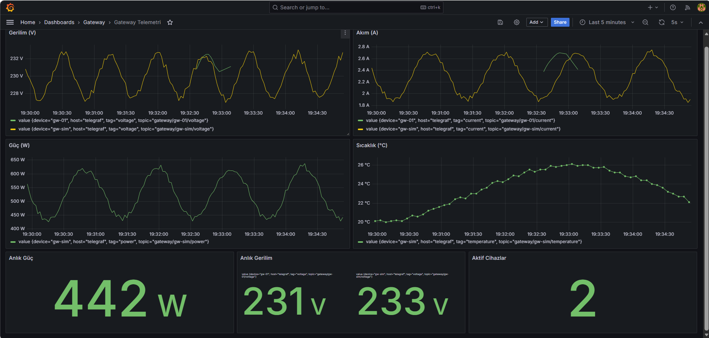
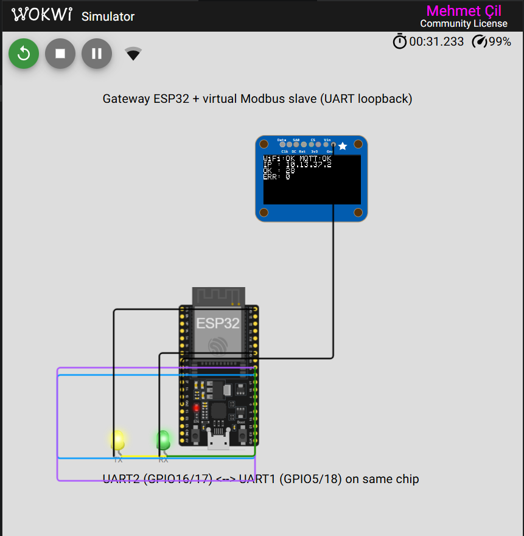

# Endüstriyel IoT Gateway — Modbus RTU → MQTT → Bulut

ESP32 tabanlı, RS485 üzerinden Modbus RTU sensör/sayaç okuyup MQTT ile buluta gönderen ve
InfluxDB + Grafana üzerinde canlı görselleştiren endüstriyel IoT gateway. Yapılandırma
tarayıcıdan yapılır, firmware OTA ile güncellenir.


*Canlı dashboard: aynı anda iki bağımsız cihazdan (Python tam stack + Wokwi sanal ESP32) gerilim, akım, güç ve sıcaklık zaman serileri. "Aktif Cihazlar: 2" — Telegraf, hem yerel Mosquitto broker'ı hem de public `test.mosquitto.org`'u dinler.*

```
                                                              ┌─────────────┐
   Pipeline A (Docker):                                        │             │
   ┌──────────────┐  Modbus  ┌──────────────┐  MQTT          │  Telegraf   │
   │ Python slave │ ───TCP─▶ │ Python gw    │ ──▶ Mosquitto ─▶│  (2x input) │──▶ InfluxDB ──▶ Grafana
   │ (PyModbus)   │ ◀──────  │ (paho-mqtt)  │   tcp://...:1883 │             │              http://localhost:3000
   └──────────────┘          └──────────────┘                 │             │
                                                              │             │
   Pipeline B (Wokwi tarayıcıda):                              │             │
   ┌──────────────┐  Modbus  ┌──────────────┐  MQTT          │             │
   │ WokwiSlave   │ ───RTU─▶ │ Gateway      │ ──▶ test.mosquitto.org:1883  ─▶
   │ (UART1)      │ ◀──────  │ (UART2+WiFi) │                 │             │
   └──────────────┘          └──────────────┘                 └─────────────┘
        ↑ aynı sanal ESP32 üzerinde, UART'lar dışarıdan cross-wire
```

İki bağımsız simülasyon hattı **aynı Grafana dashboard'unda** birleşir.
Telegraf hem yerel broker'ı hem de public `test.mosquitto.org`'u dinler.

Donanım hâlâ yolda mı? Sorun değil — proje **iki farklı donanımsız test modu** ile birlikte gelir.

<p align="center">
  
  <br>
  <em>Aynı firmware Wokwi'de sanal ESP32 üzerinde çalışıyor. WiFi + MQTT bağlı, UART loopback üzerinden Modbus okumaları başarılı (OK: 28, ERR: 0). TX/RX LED'leri canlı veri akışını gösterir.</em>
</p>

## Hızlı Başlangıç (Donanımsız)

İhtiyacınız olan tek şey **Docker Desktop**:

```bash
cd cloud
docker compose up -d --build
```

Bu komut **6 servisi** ayağa kaldırır:

| Servis | Açıklama |
|---|---|
| `mosquitto` | MQTT broker |
| `telegraf` | MQTT → InfluxDB köprüsü |
| `influxdb` | Zaman serisi veritabanı |
| `grafana` | Canlı dashboard |
| `modbus-slave` | **Sahte Modbus TCP sayaç** (V/A/W/°C) — Python |
| `gateway-sim` | **ESP32 firmware'inin yazılım eşi** — Python, gerçek Modbus + MQTT konuşur |

Ardından:

- **Grafana:** http://localhost:3000 (admin / admin) — `Gateway Telemetri` dashboard'u otomatik yüklenir
- **InfluxDB UI:** http://localhost:8086 (admin / changeme123)
- **MQTT broker:** `localhost:1883`

20-30 saniye içinde dashboard'da V/A/W/°C için canlı çizgi grafikleri görmelisiniz.

## Üç Çalıştırma Yöntemi

| Yöntem | Donanım | Kurulum | Ne yapar |
|---|---|---|---|
| **Python tam stack** | Yok | Docker Desktop | Tam pipeline'ı simüle eder. Gerçek Modbus TCP + MQTT protokolleri. CV demosu için ideal. |
| **Wokwi** | Yok | VS Code + Wokwi ext. | Gerçek ESP32 firmware'i sanal donanımda. WiFi + OLED'i tarayıcıda görürsünüz. |
| **Gerçek donanım** | ESP32 + MAX485 + Modbus sensör | USB | Üretim modu. PCB veya breadboard ile gerçek saha kullanımı. |

## Wokwi Simülasyonu (Tarayıcıda Sanal ESP32 — UART Loopback)

Wokwi yapılandırması **tek ESP32** üzerinde hem gateway master'ı hem de sanal bir
PZEM-like Modbus slave'i çalıştırır. Slave UART1'de (GPIO5/18), master UART2'de
(GPIO16/17). İki UART, kart üzerinde çapraz olarak kabloyla birbirine bağlanır;
gerçek Modbus RTU protokolü iki UART arasında konuşur:

```
                  ┌──────────────────────────────────────┐
                  │      ESP32 (Wokwi sanal donanım)     │
                  │                                       │
   GPIO17 (TX)    │  Master UART2 ───┐                    │
   ─────────────▶ │                  │ wire on board      │
                  │                  ▼                    │
   GPIO5  (RX)    │  Slave UART1   ◀─┘                    │
   ◀───────────── │                                       │
                  │  Slave TX ──┐                          │
   GPIO18 (TX)    │             │                          │
   ─────────────▶ │             ▼                          │
                  │  Master RX ◀─┘                          │
   GPIO16 (RX)    │                                       │
   ◀───────────── │                                       │
                  └──────────────────────────────────────┘
```

Slave kodu sadece `WOKWI_BUILD` build flag'i ile derlenir
([`firmware/src/wokwi_slave.cpp`](firmware/src/wokwi_slave.cpp)); gerçek
donanım modu (`-e esp32dev`) bu kodu derlemez. Wokwi Community License
tek firmware binary'sini gerektirdiği için bu yaklaşım kullanılır.

### Kurulum

1. VS Code'a [Wokwi Simulator eklentisi](https://marketplace.visualstudio.com/items?itemName=wokwi.wokwi-vscode) kurun
2. Eklenti talep ettiğinde wokwi.com'da ücretsiz lisans alın (tek tıklama)
3. Firmware'i Wokwi hedefi için derleyin:
   ```bash
   cd firmware
   pio run -e wokwi
   ```
4. VS Code'da `firmware/` klasörünü açın, `Ctrl+Shift+P` → **"Wokwi: Start Simulator"**

### Beklenen Çıktı

| OLED satırı | Anlamı |
|---|---|
| `WiFi: OK  MQTT: OK` | Wokwi-GUEST'e ve `test.mosquitto.org` broker'a bağlandı |
| `IP: 10.13.37.x` | Wokwi'nin tahsis ettiği DHCP IP'si |
| `OK: 5+` (artan) | UART loopback üzerinden Modbus okumaları başarılı |
| `ERR: 0` | Slave hep mevcut olduğu için hata olmaz |

Public broker'dan okumaları doğrulamak için:
```bash
mosquitto_sub -h test.mosquitto.org -t "gateway/gw-01/#" -v
```

## Gerçek Donanım Modu

### Bileşenler

| Bileşen | Açıklama |
|---|---|
| ESP32 DevKit (WROOM-32) | Ana MCU |
| MAX485 / TTL-RS485 modülü | RS485 fiziksel katmanı |
| 0.96" SSD1306 OLED (I2C, 0x3C) | Yerel durum göstergesi |
| Modbus slave cihaz | PZEM-004T v3, SHT20 veya Arduino slave simülatörü |

### Bağlantılar (varsayılan)

| ESP32 | Bağlandığı |
|---|---|
| GPIO 16 | RS485 RO (Receiver Output) |
| GPIO 17 | RS485 DI (Driver Input) |
| GPIO 4 | RS485 DE+RE (kısa devre) |
| GPIO 21 | OLED SDA |
| GPIO 22 | OLED SCL |

### Yükleme

```bash
cd firmware
pio run -e esp32dev -t upload          # firmware
pio run -e esp32dev -t uploadfs        # LittleFS (web UI)
pio device monitor                     # seri çıktıyı izle
```

İlk açılışta ESP32 `modbus-gateway-XXXX` adlı bir WiFi AP açar; bağlanıp ev WiFi bilgilerinizi
girersiniz. Sonra OLED'de gösterilen IP'ye tarayıcıdan bağlanıp MQTT sunucusunu, hangi
Modbus register'larının okunacağını yapılandırırsınız.

## Proje Yapısı

```
modbus-mqtt-gateway/
├── firmware/                    PlatformIO ESP32 firmware (master — gateway)
│   ├── src/                     Modüler kaynaklar (modbus, mqtt, config, web, OTA, OLED)
│   │   └── wokwi_slave.cpp      WOKWI_BUILD altında sanal Modbus slave (UART1)
│   ├── data/                    LittleFS — web UI HTML/JS
│   ├── platformio.ini           [env:esp32dev] ve [env:wokwi] hedefleri
│   ├── wokwi.toml + diagram.json Wokwi UART loopback konfigürasyonu
├── simulators/                  Donanımsız test için Python simülatörleri
│   ├── modbus_slave.py          Sahte enerji sayacı (Modbus TCP)
│   ├── gateway.py               ESP32 firmware'inin Python eşi
│   └── Dockerfile
├── cloud/                       Docker Compose bulut yığını
│   ├── docker-compose.yml       6 servis: broker + telegraf + InfluxDB + Grafana + simülatörler
│   ├── mosquitto.conf / telegraf.conf
│   └── grafana-provisioning/    Datasource + dashboard otomatik provisioning
└── docs/                        Mimari notları ve ekran görüntüleri
```

## Teknolojiler

**Firmware:** C++, ESP32 Arduino Core, FreeRTOS, eMobus, PubSubClient, ESPAsyncWebServer (ESP32Async fork), LittleFS, Adafruit SSD1306, WiFiManager, ArduinoOTA  
**Simülatörler:** Python 3.12, asyncio, PyModbus, paho-mqtt  
**Bulut yığını:** Docker Compose, Eclipse Mosquitto, Telegraf, InfluxDB 2.x, Grafana 11.x  
**Tooling:** PlatformIO, Wokwi

## Yol Haritası

- [x] Modbus RTU master + JSON MQTT publish
- [x] Web tabanlı konfigürasyon + OTA güncelleme
- [x] InfluxDB + Grafana ile zaman serisi görselleştirme
- [x] Python tabanlı tam stack simülatör (donanımsız test)
- [x] Wokwi entegrasyonu (tarayıcıda sanal ESP32)
- [ ] TLS destekli MQTT (HiveMQ Cloud)
- [ ] Çevrimdışı veri buffer'ı (LittleFS ring buffer)
- [ ] Modbus TCP master desteği
- [ ] İmzalı OTA firmware

## Lisans

MIT
